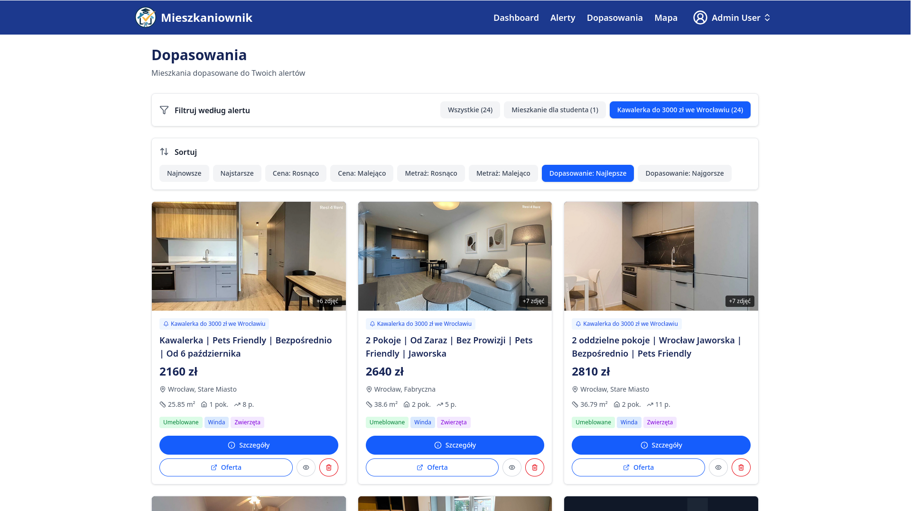
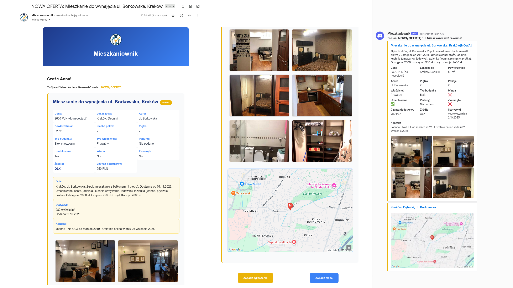

<p align="center">
  
</p>

<p align="center">
    <strong>Your key to student housing</strong>
</p>

<p align="center">
<a href="https://discord.com/oauth2/authorize?client_id=1422117898389819532&scope=bot&permissions=268435456">
    
</a>

<a href="https://discord.gg/W2SCjUYXCe">
    
</a>

<a href="mailto:mieszkaniownik@gmail.com">
    
</a>
</p>

## Tech Stack

<div align="center">

[](https://react.dev/) [](https://vite.dev/) [](https://tailwindcss.com/) [](https://reactrouter.com/)

[](https://www.docker.com/) [](https://kubernetes.io/) [](https://helm.sh/) [](https://nginx.org/) 

[]() [](LICENSE)

</div>

## About the Project

**Mieszkaniownik** is a solution designed for students looking for an apartment or room to rent. With the current turnover of rental offers on platforms like OLX, every second counts. Why spend hours refreshing the website when you can simply create an alert, specify what kind of apartment you're interested in and your budget? Then, as soon as an offer appears, you'll receive a notification via email or Discord with all the most important information.

### Target Audience

Students looking for a room or apartment

### Added Value

- **Time saved** - automatic offer monitoring instead of manual refreshing
- **Faster apartment finding** - instant notifications about new offers
- **More offers to choose from** - aggregation from multiple sources
- **Stress reduction** - no fear or stress associated with apartment hunting

## Application Features

### Dashboard

Monitor your apartment search with personalized statistics and recent matches.


### Matches

Browse matched apartments that fit your alert criteria.



### Alerts

Manage your apartment search alerts with custom filters.


### Notifications

Stay informed with email notifications about new matching offers.



### Heatmap

Explore apartment density across the city with interactive heatmaps.


### Main Page

Welcome screen with quick access to all features.


## 🚀 Production Deployment

This application is deployed on **Google Cloud Platform (GCP)** with:

- ✅ **HTTPS** with automatic SSL certificates
- ✅ **Automatic deployment** via GitHub Actions
- ✅ **Horizontal scaling** with Kubernetes HPA
- ✅ **CDN caching** for optimal performance
- ✅ **Daily full synchronization** via CronJobs
- ✅ **Monitoring and alerting** with Prometheus & Grafana

### Quick Start Deployment

```bash
# Make the quick start script executable
chmod +x quickstart.sh

# Run the interactive setup
./quickstart.sh
```

For detailed deployment instructions, see [DEPLOYMENT.md](DEPLOYMENT.md)

### Deployment Architecture

- **Infrastructure**: GKE (Google Kubernetes Engine)
- **Container Registry**: Google Container Registry (GCR)
- **SSL/TLS**: Let's Encrypt via cert-manager
- **Load Balancing**: Nginx Ingress Controller
- **Monitoring**: Prometheus, Grafana, Cloud Monitoring
- **CI/CD**: GitHub Actions + Google Cloud Build

### Environments

- **Application**: `https://mieszkaniownik.wsparcie.dev`
- **API**: `https://api.mieszkaniownik.wsparcie.dev`

## 📋 Development

### Prerequisites

- Node.js 20+
- npm or yarn
- Docker (optional)

### Local Setup

```bash
# Install dependencies
npm install

# Start development server
npm run dev

# Build for production
npm run build

# Run linter
npm run lint

# Format code
npm run format
```

### Docker Development

```bash
# Build image
docker build -t mieszkaniownik-frontend .

# Run container
docker run -p 5173:5173 mieszkaniownik-frontend
```

## 🔧 Configuration

Environment variables are configured in:
- `.env.development` - Development environment
- `.env.production` - Production environment

Key variables:
- `VITE_API_URL` - Backend API URL
- `VITE_ENABLE_DEBUG` - Enable debug mode
- `VITE_LOG_LEVEL` - Logging level

## 📊 Monitoring

View application health:

```bash
# Check deployment status
kubectl get all -n production

# View logs
kubectl logs -f deployment/mieszkaniownik-frontend -n production

# Run health check
./scripts/health-check.sh production
```

## 🔄 CI/CD Pipeline

The project uses GitHub Actions for continuous deployment:

1. **Push to `dev` branch** → Auto-deploy to development
2. **Push to `main` branch** → Auto-deploy to production
3. **Create tag `v*`** → Versioned production deployment

## 🛡️ Security

- All traffic encrypted with HTTPS
- Security headers configured
- Rate limiting enabled
- Network policies in place
- Regular dependency updates via Dependabot
- Automated security scanning

See [SECURITY.md](SECURITY.md) for more details.

## 📚 Documentation

- [Deployment Guide](DEPLOYMENT.md) - Complete production deployment instructions
- [Deployment Checklist](DEPLOYMENT_CHECKLIST.md) - Pre/post deployment checklist
- [Scripts Documentation](scripts/README.md) - DevOps scripts usage

## 🤝 Contributing

1. Fork the repository
2. Create your feature branch (`git checkout -b feature/AmazingFeature`)
3. Commit your changes (`git commit -m 'Add some AmazingFeature'`)
4. Push to the branch (`git push origin feature/AmazingFeature`)
5. Open a Pull Request

## 📝 License

This project is licensed under the MIT License - see the [LICENSE](LICENSE) file for details.

```
